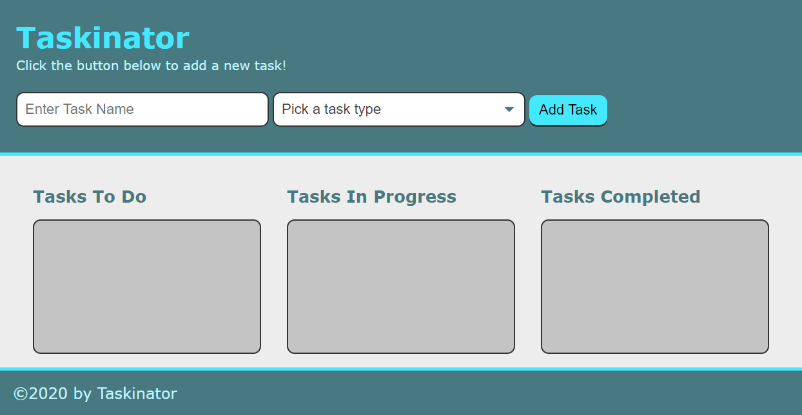

# Taskinator

## Page Description
This page uses JavaScript to provide a task-tracker app. A user can add and delete tasks, edit the name and type of an existing task, and move tasks from To Do to In Progress to Complete, similar to a Kanban board.  Task status can be changed either through the dropdown menu or through dragging and dropping a task to the desired list. Tasks are saved in local storage and loaded for the user upon the page loading.  

## Built With:

*HTML
*CSS
*JavaScript

## Page Link
The page is hosted at https://kpehl.github.io/taskinator/ 

## Screenshot
